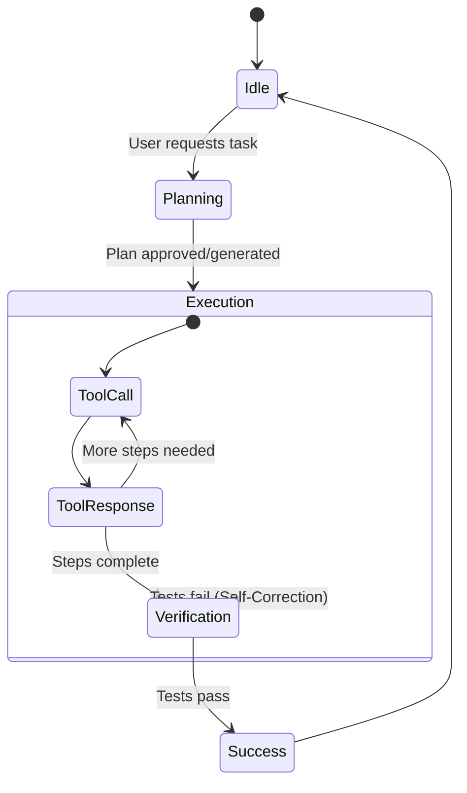

# ฅ^•ﻌ•^ฅ KittyCode: Architectural Deep Dive & Documentation

Welcome to the definitive architectural guide for **KittyCode-Agent**. This document provides a comprehensive look into how Kitty works under the hood, detailing every minute component, data flow, and security measure that powers this autonomous coding assistant.

---

## 1. Philosophy & Vision

KittyCode was designed with a core philosophy: **"An AI assistant should be a transparent pair-programmer, not a black box."** 

Unlike traditional code generators that blindly spit out code, KittyCode operates through an **Autonomous Loop** with built-in reflection, planning, and real-time observability. You see every tool she uses, every file she reads, and every plan she formulates.

---

## 2. System Architecture

The architecture is built around a central `KittyAgent` that acts as the orchestrator. It connects the user interface (CLI) to the intelligence layer (Models), execution layer (Tools), and state management (Memory & Context).


---

## 3. Core Components Deep Dive

### 3.1 The Autonomous Loop (Agent & Planner)

The brain of the operation lives in `kittycode/agent/kitty.py`. When in "Code Mode", Kitty does not immediately start writing code. Instead, she utilizes a **Plan-First Architecture**.

1. **Task Ingestion**: The user provides a goal.
2. **Context Gathering**: The `Codebase Indexer` (`ls_tree` + `read_file`) pulls relevant project structure and system prompts.
3. **Planning Phase**: The `Planner` module generates a structured JSON plan, evaluating dependencies and step-by-step logic.
4. **Execution Phase**: The agent iterates through the plan, invoking the `ToolEngine` to read files, modify code, or run bash commands.
5. **Verification**: After execution, the agent checks the output (e.g., running tests). If a failure occurs, the agent loops back to fix the code autonomously.



### 3.2 Model Routing & Quantum Fallbacks

Found in `kittycode/models/router.py`, the routing system is designed to handle API failures, rate limits, and budget constraints without crashing.

- **Primary Models**: High-end models like `Qwen 2.5 Coder` or `DeepSeek-R1` are selected based on user preference.
- **Health Tracking**: The system tracks the latency and success rate of every model. If a model fails 3 times, it is marked as "Unhealthy."
- **Auto-Healing Authentication**: If an API returns a `401 Unauthorized` (e.g., a bad key), the Router intercepts the error, pauses the loop, and prompts the user to re-run the setup wizard, preventing infinite crash loops.
- **Quantum-Inspired Architecture (`kittycode.quantum`)**: To handle complex ambiguity without external dependencies, Kitty implements pure-Python probabilistic heuristics:
  - **Superposition Routing (`router_q.py`)**: Models are treated as being in a state of superposition. The router collapses to a specific model based on "phase interference" (latency, cost, token limits) and historical success rates, dynamically shifting to cheaper models (like `gpt-4o-mini`) to prevent `402 Payment Required` errors.
  - **Annealing-Inspired Planning (`planner_q.py`)**: During the Plan-First phase, the agent uses a simulated quantum annealing algorithm to minimize task sequencing risk, sorting dependencies to find the global minimum cost path for execution.

### 3.3 Tool Engine & Sandbox Security

The `ToolEngine` (`kittycode/tools/engine.py`) exposes a specific set of tools to the LLM (e.g., `view_file`, `replace_file_content`, `run_command`).

**The Sandbox Validator (`security/sandbox.py`)** acts as the absolute gatekeeper:
- **Path Traversal Prevention**: Any tool call trying to access files outside the `PROJECT_ROOT` (e.g., `../../etc/passwd`) is immediately blocked.
- **Command Whitelisting**: Potentially destructive commands are flagged.
- **Security Patch 1.0**: The `kitty secure` command triggers the `audit_security_posture()` function, which scans for leaked API keys in log files, ensures the `.env` file is permission-locked, and verifies key integrity.

### 3.4 Structured Memory & The Vault

KittyCode remembers your preferences, architectural decisions, and common bugs.

- **Memory Manager (`memory/manager.py`)**: Stores facts in a JSON-backed structured graph. To search this graph efficiently, it utilizes **Grover-style amplitude amplification (`memory_q.py`)** for $O(\sqrt{N})$ token matching pre-filtering, simulating quantum search probabilities before falling back to classic keyword matching.
- **The Security Vault (`security/vault.py`)**: Because memory can contain sensitive API keys or proprietary code, facts are encrypted at rest using **AES-256-GCM**.
  - **Cryptographic Key Derivation**: The encryption key is dynamically derived on the host machine. It extracts a stable hardware identifier (e.g., `wmic csproduct get UUID` on Windows, or `/etc/machine-id` on Unix). This machine ID, combined with an optional user passphrase, is salted (SHA-256) and passed through **PBKDF2-HMAC with 200,000 iterations** to generate a secure 32-byte (256-bit) encryption key, ensuring local privacy without hardcoded secrets.

---

## 4. Workflows & Examples

### The Setup Wizard (`kitty setup`)
The onboarding process is designed to be fool-proof:
1. **Path Diagnostics**: Checks if `python/Scripts` is in the user's `PATH`. If not, it provides step-by-step Windows instructions.
2. **Aesthetics**: Selects terminal themes (Catgirl, Matrix, Dracula).
3. **Intelligence**: Securely requests and saves OpenRouter/Gemini API keys to `~/.kittycode/.env`.

### Chat Mode vs. Code Mode
- **Chat Mode**: Kitty acts as a standard conversational agent. She can read files to answer questions but will not execute modifying commands.
- **Code Mode**: Kitty assumes full autonomy. She will read, write, and execute commands (with your permission) to fulfill a complex task.

---

## 5. Developer & Contributor Guide

If you wish to contribute or modify KittyCode, here is the repository layout:

```text
kitty-CLI/
├── kittycode/               # Core Application Package
│   ├── agent/               # Autonomous logic, Planning, State machine
│   ├── cli/                 # Typer/Rich UI, Setup wizards, App entrypoint
│   ├── config/              # Settings, Environment parsing
│   ├── context/             # Codebase indexer, KITTY.md loader
│   ├── core/                # System prompts, Safety Critic
│   ├── memory/              # Graph storage, retrieval algorithms
│   ├── models/              # Model Router, OpenRouter/Gemini clients
│   ├── security/            # Sandbox, Audits, Encryption Vault
│   ├── telemetry/           # Real-time logging, metrics
│   └── tools/               # File readers, Writers, Git, AST tools
├── tests/                   # Pytest suite
├── pyproject.toml           # PEP 517 build configuration & dependencies
├── install.sh / .bat        # One-click installer scripts
└── README.md                # User landing page
```

**Development Requirements:**
- Python >= 3.9
- Run `pip install -e ".[dev]"` to install pytest, black, and mypy.
- Run tests via `python -m pytest`.
