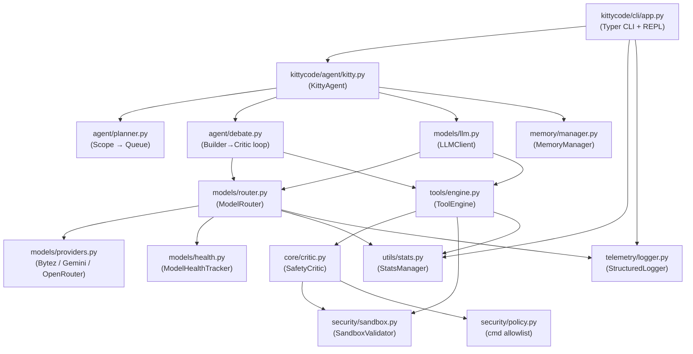

# KittyCode CLI

KittyCode is a local-first AI coding CLI with:
- Structured memory management
- Multi-model routing with health-based failover
- Sandboxed tool execution with safety gates
- Interactive and command-style endpoints

## Install

```bash
pip install -r requirements.txt
pip install -e .
```

Build artifacts:
```bash
python scripts/build_artifacts.py
```

## Configure

Create `~/.kittycode/.env`:

```env
BYTEZ_API_KEY=your_key_here
```

Optional:
- `KITTY_MEMORY_BACKEND=keyword` (default) for safest offline mode.
- `KITTY_MEMORY_BACKEND=vector` (or `auto`) to enable semantic vector retrieval.
- `KITTY_MEMORY_ALLOW_DOWNLOAD=1` to allow first-time embedding model download for vector mode.
- `KITTY_CMD_ALLOWLIST=python,pytest,git,...` to customize allowed `run_cmd` executable prefixes.

## CLI Endpoints

- `kitty` : interactive REPL
- `kitty doctor` : environment diagnostics
- `kitty models` : model health and routing table
- `kitty models --set-primary gpt-4.1` : set session primary model
- `kitty models --set-primary claude-sonnet --persist` : persist primary model to project state
- `kitty models --show-chain Code` : show configured vs resolved routing chain
- `kitty models --reset --persist` : reset routing preferences to defaults
- `kitty memory --limit 20` : inspect structured memory records
- `kitty memory --category bugs` : filter memory by category
- `kitty memory add --key bug_42 --value "router timeout" --category bugs` : add memory
- `kitty memory find "timeout bug"` : search memory context
- `kitty memory prune --max 300 --dedupe` : prune and deduplicate memory store
- `kitty memory export --path memory_backup.json` : export memory to JSON
- `kitty stats` : observability dashboard (model + command usage/latency/failures)
- `kitty chat "explain this file"` : one-shot chat response
- `kitty run "analyze this repo"` : one-shot plan generation
- `kitty run "fix tests" --execute --yes` : execute generated queue non-interactively
- `kitty config --set-theme matrix` : view/update runtime config
- `kitty version` : installed CLI version
- `kitty readiness` : run production release-readiness gate checks
- add `--json` to command endpoints for machine-readable output

## Architecture

- `kittycode/cli` : terminal app and command endpoints
- `kittycode/agent` : planner, debate loop, orchestration
- `kittycode/models` : multi-model routing and health tracking
- `kittycode/memory` : structured memory + semantic/keyword retrieval
- `kittycode/tools` : tool registry and execution engine
- `kittycode/security` : path sandbox validator



The data flow for a Code-mode task:  
`User input → CLI → KittyAgent → Planner (scope) → queue of tasks → DebateManager (Builder + Critic) → ToolEngine → SafetyCritic → SandboxValidator → fs/cmd execution → flush all state`

---

## Notes

- Tool execution is sandboxed to project scope and destructive actions require confirmation.
- `run_cmd` is policy-guarded (allowlist + blocked shell control tokens/flags).
- Command endpoints emit trace-aware structured logs and command latency metrics.
- API keys are never hardcoded in source.
- Packaging metadata is defined in `pyproject.toml`.
- Release process is documented in `docs/release-policy.md` and `docs/release-checklist.md`.
- Final release gate criteria are in `docs/release-readiness-v1.md`.
