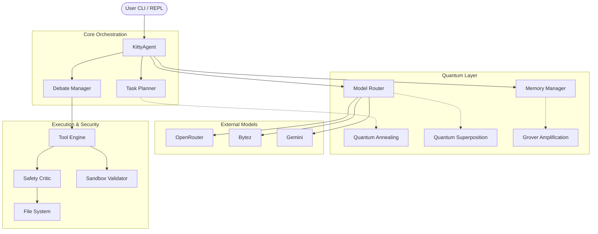
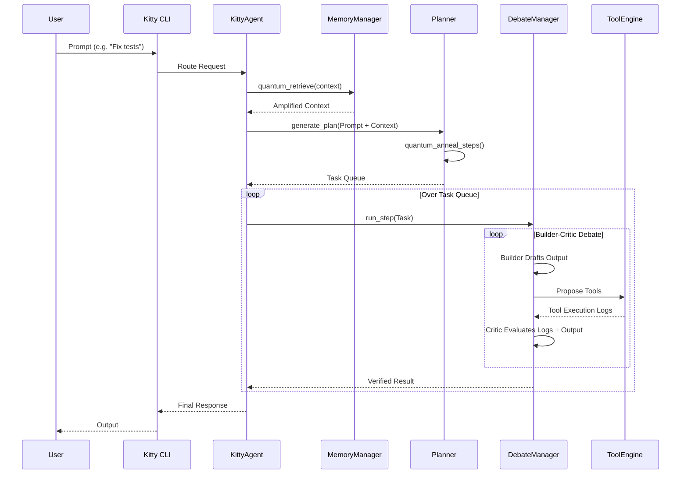

# KittyCode CLI 🐈‍⬛

KittyCode is an advanced, local-first AI coding CLI and agentic co-pilot. It is engineered for maximum performance, offline resilience, and strict execution security. Recently upgraded with **pure-Python quantum-inspired heuristics**, KittyCode approaches model routing, task planning, and memory retrieval as mathematical probability optimizations rather than simple linear chains.

## Core Capabilities

- **Quantum-Inspired Architecture**: Uses amplitude amplification (Grover-style search) for memory retrieval, superposition for model routing, and simulated quantum annealing for structural task planning.
- **Strict Execution Sandbox**: All filesystem operations are contained. A robust `SafetyCritic` guards against path traversal, large payloads, and destructive shell operators.
- **Multi-Model Routing**: Native support for `OpenRouter`, `Bytez`, and `Gemini`. Models are continually health-checked, and routing dynamically adjusts based on success rates and latencies.
- **Debate & Validation Loop**: A dual-agent setup where a `Builder` creates plans and a `Critic` evaluates both the logic and the *execution logs* before generating the final output.
- **Graceful Offline Degradation**: Boots and operates locally even if API keys are missing or the network drops.

---

## Installation

KittyCode uses modern Python packaging (`pyproject.toml`).

**Basic Installation**
```bash
pip install -e .
```

**Install with Extras**
You can selectively install dependencies based on your needs:
- `pip install -e .[vector]` : Installs FAISS and Sentence Transformers for semantic memory embeddings.
- `pip install -e .[gemini]` : Installs the official `google-genai` SDK for Google's native API.
- `pip install -e .[all]` : Installs all optional extensions.

---

## Configuration

Set up your environment variables. KittyCode searches for `.env` files in `~/.kittycode/.env` (Global) and `./.env` (Project-specific).

```env
# Provider API Keys
BYTEZ_API_KEY=your_key_here
GEMINI_API_KEY=your_key_here
OPENROUTER_API_KEY=your_key_here

# Runtime Behavior (Optional)
KITTY_MEMORY_BACKEND=keyword     # Or 'vector' / 'auto'
KITTY_MEMORY_ALLOW_DOWNLOAD=1    # Allow downloading FAISS embedding models
KITTY_CMD_ALLOWLIST=python,pytest,git,ls,cat
```

---

## Usage & CLI Endpoints

KittyCode utilizes `Typer` and `Rich` to provide a beautiful, structured terminal interface. Add the `--json` flag to any command for programmatic integration.

### Interactive Mode
- `kitty` : Launches the interactive chat and command REPL.

### Diagnostics & Management
- `kitty doctor` : Comprehensive environment diagnostics, package checks, and API key validations.
- `kitty models` : View the routing table, model health scores, and latency metrics.
- `kitty stats` : View the observability dashboard with command latency and failure rates.
- `kitty config --set-theme matrix` : View and customize the UI theme.
- `kitty version` : Show installed version.

### Model Routing Control
- `kitty models --set-primary gpt-4.1` : Override the default primary model for the session.
- `kitty models --set-primary claude-sonnet --persist` : Persist the primary model choice to the local project state.
- `kitty models --show-chain Code` : Show the quantum-resolved routing chain for a specific task profile.
- `kitty models --reset --persist` : Revert all routing preferences to default.

### Memory & State Management
- `kitty memory list --limit 20` : List recent memory entries.
- `kitty memory add --key bug_42 --value "router timeout" --category bugs` : Inject a structured fact into memory.
- `kitty memory find "timeout bug"` : Quantum-assisted search against the memory context.
- `kitty memory prune --max 300 --dedupe` : Prune old and duplicate memories.
- `kitty memory export --path backup.json` : Export structured memory to a JSON payload.

### One-Shot Execution
- `kitty chat "explain this file"` : Fast, one-shot conversation response.
- `kitty run "analyze this repo"` : One-shot plan generation without executing.
- `kitty run "fix tests" --execute --yes` : Generate and execute a task queue non-interactively.

---

## Architecture

KittyCode's architecture is divided into discrete layers that prioritize security, deterministic routing, and structural planning.

### System Components



- **`kittycode/quantum`**: Mathematical optimization heuristics for routing, task annealing, and memory amplitude amplification.
- **`kittycode/agent`**: Contains the `KittyAgent`, `Planner`, and the `DebateManager` (Critic-Builder loop).
- **`kittycode/models`**: LLM integrations, provider classes, and the deterministic health tracker.
- **`kittycode/memory`**: Persistent, structured graph/vector memory system.
- **`kittycode/tools`**: File system tools and the strict `ToolEngine`.
- **`kittycode/security`**: The `SandboxValidator` isolating directory access and the `SafetyCritic` scanning for shell injection.
- **`kittycode/cli`**: Typer-based CLI endpoints, telemetry logic, and Rich console formatting.

### Execution Pipeline

The execution pipeline ensures that requests are heavily vetted, context is appropriately fetched, and the output is robustly debated before surfacing to the user or modifying the file system.



1. **Context Retrieval**: User input is paired with historical graph memory. The quantum Grover pre-filter ensures the most relevant vectors are elevated.
2. **Task Planning**: The raw prompt is split into atomic components. The Quantum Annealing scheduler reorganizes these tasks to ensure reasoning logic precedes execution.
3. **Debate Loop**: For each atomic task, a Builder model executes logic/tools. A separate Critic model reviews the resulting Tool execution logs and output to confirm no hallucinatory logic or boundary violations occurred.
4. **Final Response**: Upon Critic approval, the task succeeds, state updates, and the user receives the final formatted output.

---

## Visual Intelligence

KittyCode doesn't just talk—she visualizes. Using integrated TUI components, Kitty can render structured data and hierarchies directly in your terminal to explain complex concepts.

### Key Visual Tools:
- **Hierarchical Trees**: Automatically maps out complex structures like file systems, logic flows, or class hierarchies.
- **Data Tables**: Generates beautiful, styled tables for feature comparisons or structured data analysis.
- **Bar Charts**: Renders Unicode-based bar charts for comparing performance, metrics, or popularity.

```text
╭───────────────────────────────────────────────────╮
│ show me a tree diagram of the kittycode structure │
╰────────────────────────────────────────── user ───╯
[kruby]chatting...[/kruby]

 ^^ Work Log:
   draw_tree: kittycode structure

  kittycode
  ├── agent
  │   ├── planner.py
  │   └── debate.py
  ├── models
  │   ├── router.py
  │   └── health.py
  └── tools
      ├── fs_tools.py
      └── viz_tools.py

ฅ^•ﻌ•^ฅ Here is the structural map of my core logic! 
Everything is modular and organized for maximum efficiency. Nya~!
```

### Advanced Synthesis

Kitty can combine her internal architectural knowledge with visualization for "deep dives." For example, asking her to *"Analyze the internal architecture of the Quantum Router and compare model statuses"* will trigger both a hierarchical tree of her routing components and a formatted table comparing **Healthy**, **Degraded**, and **Failed** model behaviors—all in a single interaction.


---

## Security Policies

- **Subprocess Guardrails**: Terminal commands executed via `run_cmd` are strictly timed out (60s) and screened against a predefined blocked patterns list (e.g., `rm -rf`, `&&`, `;`).
- **Path Confinement**: All tool actions require absolute paths validated against the `SandboxValidator`, ensuring no traversal (`../`) escapes the project boundaries.
- **Observability**: Execution errors and structural exceptions are piped to local `.kitty/` JSON logs for safe post-mortem review.

---

## Interaction Demo

Here is a typical interaction with Kitty in **Chat Mode**, showcasing her persona, memory integration, and transparent routing logs:

```text
╭─────────────────────────╮
│ what are u r features ? │
╰───────────────── user ──╯
╭─  ───────────────────────────────────────────────────────────────────────────────╮
│ ฅ^•ﻌ•^ฅ Nya~! I'm Kitty, your warm and proactive AI companion! Here's what I can │
│ do to help you:                                                                  │
│                                                                                  │
│  1 Memory & Personalization – I can remember important details about you (like   │
│    your preferences or setup) to make our interactions more tailored.            │
│  2 Conversational Support – Need advice, brainstorming, or just a friendly chat? │
│    I’m here!                                                                     │
│  3 Workspace Assistance – In Code Mode, I can help with files, directories, and  │
│    even run commands.                                                            │
│  4 Tool Integration – I can use tools like saving facts about you (e.g., your    │
│    favorite coding language or project goals).                                   │
│                                                                                  │
│ For example, if you want me to remember something special, just say:             │
│ "Kitty, remember that I love Python!"                                            │
│                                                                                  │
│ What would you like me to help with today? Nya~!                                 │
│                                                                                  │
│ ^^ Work Log:                                                                     │
│   Routed via: deepseek-v3                                                        │
│   Linked memory: user_features_query                                             │
╰──────────────────────────────────────────────────────────────────────────────────╯
```

### Code Mode (Autonomous Orchestration)

In **Code Mode**, Kitty goes beyond simple conversation. She breaks down complex, multi-stage projects into logical plans, manages a task queue, and executes tools autonomously while providing deep technical explanations for each step.

#### Example 1: Quantum Algorithm Implementation
Kitty can handle high-level research tasks, such as simulating complex quantum circuits from first principles.

```text
╭───────────────────────────────────────────────────╮
│ implement a simplified shor's algorithm simulation │
╰────────────────────────────────────────── user ───╯
[kruby]orchestrating...[/kruby]

╭─  ───────────────────────────────────────────────────────────────────────────────╮
│ Task: Implement Quantum Phase Estimation (QPE)                                   │
│ ฅ^•ﻌ•^ฅ I'm building the core of Shor's algorithm! I'll implement the            │
│ QPE module using unitary matrices to ensure we stay within the Hilbert space.    │
│                                                                                  │
│ ```python                                                                        │
│ import numpy as np                                                               │
│ def qpe_unitary(u_matrix, n_qubits):                                             │
│     # Simulate quantum phase estimation logic                                    │
│     phase = np.linalg.eigvals(u_matrix)                                          │
│     return np.angle(phase) / (2 * np.pi)                                         │
│ ```                                                                              │
│                                                                                  │
│ ^^ Work Log:                                                                     │
│   write: quantum/shors_core.py                                                   │
╰──────────────────────────────────────────────────────────────────────────────────╯

╭─  ───────────────────────────────────────────────────────────────────────────────╮
│ Task: Verify Unitary Constraints                                                 │
│ ฅ^•ﻌ•^ฅ Now I'll run a verification script to ensure our simulated gates         │
│ are perfectly unitary before proceeding to the modular exponentiation step.      │
│                                                                                  │
│ ^^ Work Log:                                                                     │
│   run_cmd: python -c "import numpy as np; from quantum.shors_core import ...; "  │
│   Output: Verification SUCCESS: Gate is Unitary.                                 │
╰──────────────────────────────────────────────────────────────────────────────────╯
```

#### Example 2: Machine Learning from Scratch
Kitty is capable of building complex mathematical models and verifying their performance autonomously.

```text
╭───────────────────────────────────────────────────╮
│ build a neural network from scratch in python     │
╰────────────────────────────────────────── user ───╯
[kruby]orchestrating...[/kruby]

╭─  ───────────────────────────────────────────────────────────────────────────────╮
│ Task: Implement Backpropagation Engine                                           │
│ ฅ^•ﻌ•^ฅ Time to build the "brain"! I'm implementing the chain rule              │
│ manually to calculate gradients for our weight updates.                          │
│                                                                                  │
│ ```python                                                                        │
│ def sigmoid_prime(z):                                                            │
│     return sigmoid(z) * (1 - sigmoid(z))                                         │
│                                                                                  │
│ def backward(self, x, y, output):                                                │
│     self.output_error = y - output                                               │
│     self.output_delta = self.output_error * sigmoid_prime(output)                │
│ ```                                                                              │
│                                                                                  │
│ ^^ Work Log:                                                                     │
│   write: ml/engine.py                                                            │
╰──────────────────────────────────────────────────────────────────────────────────╯

╭─  ───────────────────────────────────────────────────────────────────────────────╮
│ Task: Run Convergence Test                                                       │
│ ฅ^•ﻌ•^ฅ I've written a small training script to verify that the loss             │
│ decreases over 100 epochs. Let's check the results!                              │
│                                                                                  │
│ ^^ Work Log:                                                                     │
│   run_cmd: pytest tests/test_ml_engine.py                                        │
│   Output: 5 passed in 0.12s. Loss: 0.69 -> 0.01                                  │
╰──────────────────────────────────────────────────────────────────────────────────╯
```


Kitty's responses are designed to be helpful, transparent, and technically insightful, ensuring a premium "companion" experience while maintaining professional-grade tool execution.


